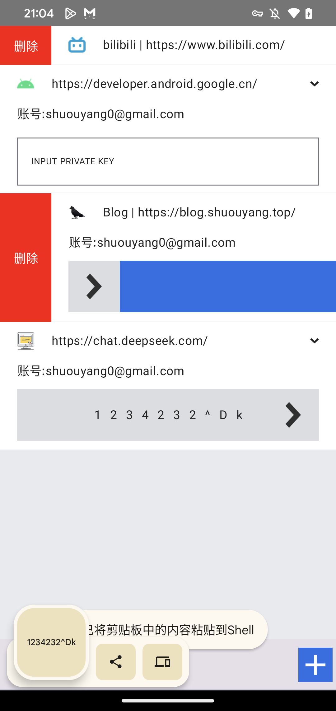

# A Password Management Tool Based on Kotlin/Compose Multiplatform

[中文文档](./README_zh.md)

> Primarily a practice project. Currently, it can be successfully compiled and run on Android and Desktop. The iOS version is pending due to [KSP2 issues](https://issuetracker.google.com/issues/398414973).

## Dependencies Used

- **Coil**: Image Loading - [https://coil-kt.github.io/coil/compose/](https://coil-kt.github.io/coil/compose/)
- **Ktor**: HTTP Client - [https://ktor.io/docs/client-create-multiplatform-application.html#android-activity](https://ktor.io/docs/client-create-multiplatform-application.html#android-activity)
- **Koin**: Dependency Injection - [https://insert-koin.io/docs/quickstart/cmp/](https://insert-koin.io/docs/quickstart/cmp/)
- **Room**: Database - [https://developer.android.com/kotlin/multiplatform/room?hl=zh-cn](https://developer.android.com/kotlin/multiplatform/room?hl=zh-cn)
- **Paging**: Pagination Library - [https://github.com/cashapp/multiplatform-paging](https://github.com/cashapp/multiplatform-paging)
- **Hash**: Hashing Library - [https://github.com/KotlinCrypto/hash/](https://github.com/KotlinCrypto/hash/)
- **Serialization**: Serialization - [https://github.com/Kotlin/kotlinx.serialization](https://github.com/Kotlin/kotlinx.serialization)
- **Navigation**: Navigation - [https://www.jetbrains.com/help/kotlin-multiplatform-dev/compose-navigation-routing.html](https://www.jetbrains.com/help/kotlin-multiplatform-dev/compose-navigation-routing.html)

## Planned Features

- Add / Modify / Search / Delete Website Records ✔️
- Password Generation Algorithm Based on Private Key ✔️
- Automatic Password Copy to Clipboard ✔️
- Display Website Icon Based on URL ✔️ (Can be optimized)
- Scan QR Code to Add Website on Android / iOS

## Known Issues

The iOS version fails to compile due to [KSP2 issues](https://issuetracker.google.com/issues/398414973). Waiting for an official fix before further updates.