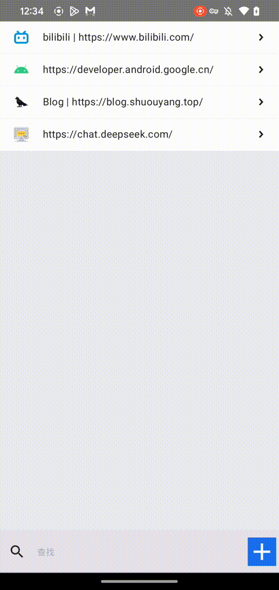

# 基于 Kotlin / Compose Multiplatform 的密码记录工具

  
  

[English Doc](https://./README.md)

## 背景

作为一名开发者，日常需要登录的网站众多，且使用的设备系统各异。每个网站的密码要求不同，使用相同密码存在安全隐患，而使用不同密码则难以记忆。

## 解决方案

只需记住一个私钥，结合网站地址和登录账号（邮箱或电话号码），生成符合大多数网站要求的密码（包含小写字母、大写字母、数字和特殊字符）。为保障安全，密码不直接存储，而是保存其 SHA-256 加密值。查看明文密码时，需输入私钥验证，验证通过后动态计算明文密码。支持复制密码功能。

因此，决定使用 Kotlin / Compose Multiplatform 开发一款跨平台密码工具。

> 本项目偏重于练手，支持 Android、iOS 和 Desktop 三端运行。

  

------

## 功能交互

- **首页**：显示已添加的密码记录，支持通过底部搜索栏进行模糊搜索。
- **添加记录**：点击底部加号按钮，进入添加密码页面。
- **查看密码**：点击记录项，可预览相关信息，输入私钥后显示明文密码。
- **编辑记录**：长按记录项，进入编辑页面。
- **删除记录**：右滑记录项，显示删除按钮。

------

## 技术栈

- **Coil**：图片加载 - [Coil Docs](https://coil-kt.github.io/coil/compose/)
- **Ktor**：HTTP 客户端 - [Ktor Docs](https://ktor.io/docs/client-create-multiplatform-application.html#android-activity)
- **Koin**：依赖注入 - [Koin Docs](https://insert-koin.io/docs/quickstart/cmp/)
- **Room**：数据库 - [Room Docs](https://developer.android.com/kotlin/multiplatform/room?hl=zh-cn)
- **Paging**：分页库 - [Paging Repo](https://github.com/cashapp/multiplatform-paging)
- **Hash**：哈希编码库 - [Hash Repo](https://github.com/KotlinCrypto/hash/)
- **Serialization**：序列化 - [Serialization Repo](https://github.com/Kotlin/kotlinx.serialization)
- **Navigation**：导航 - [Navigation Docs](https://www.jetbrains.com/help/kotlin-multiplatform-dev/compose-navigation-routing.html)

------

## 计划功能

- **基础功能**
  - 添加 / 修改 / 搜索 / 删除网站记录 ✔️
  - 基于私钥生成密码的算法 ✔️
  - 密码自动复制到剪贴板 ✔️
  - 基于网站显示图标 ✔️（可优化）
- **待开发功能**
  - Android / iOS 扫码添加网站
  - 密码多端同步（需后端支持）
  - 代码优化

------

## 已知问题

- **iOS 编译问题**：由于 [KSP 问题](https://issuetracker.google.com/issues/398414973)，iOS 编译始终无法通过。预计在 2025.3.5 修复后更新。
